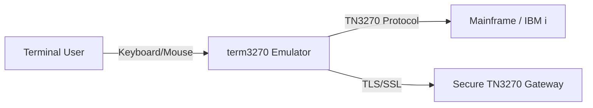
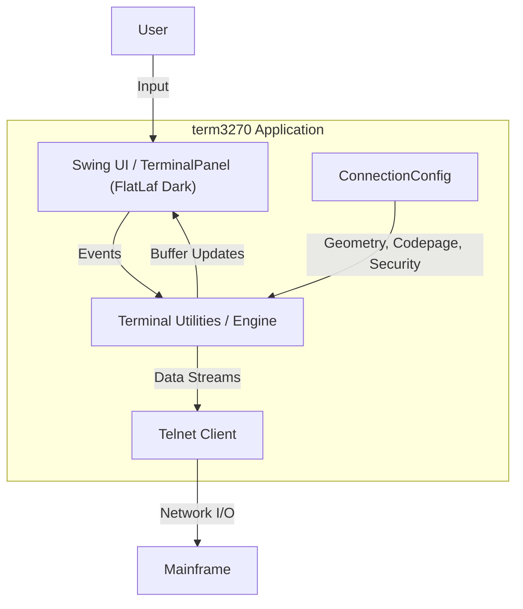
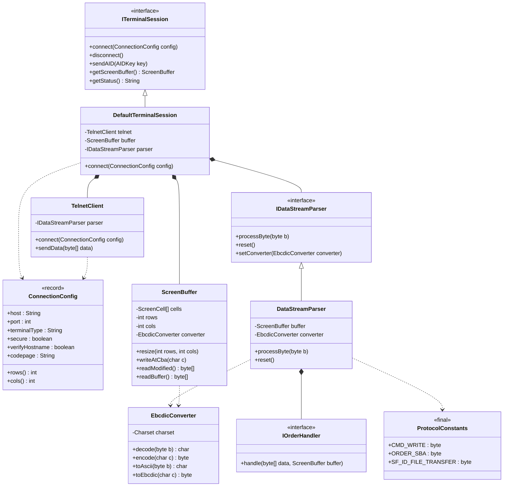
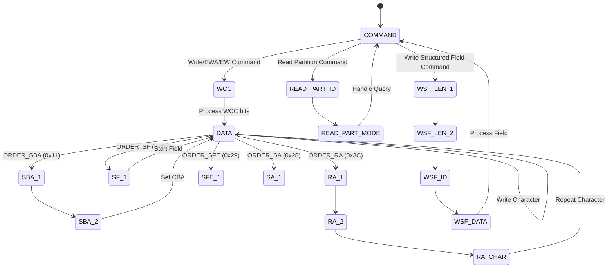
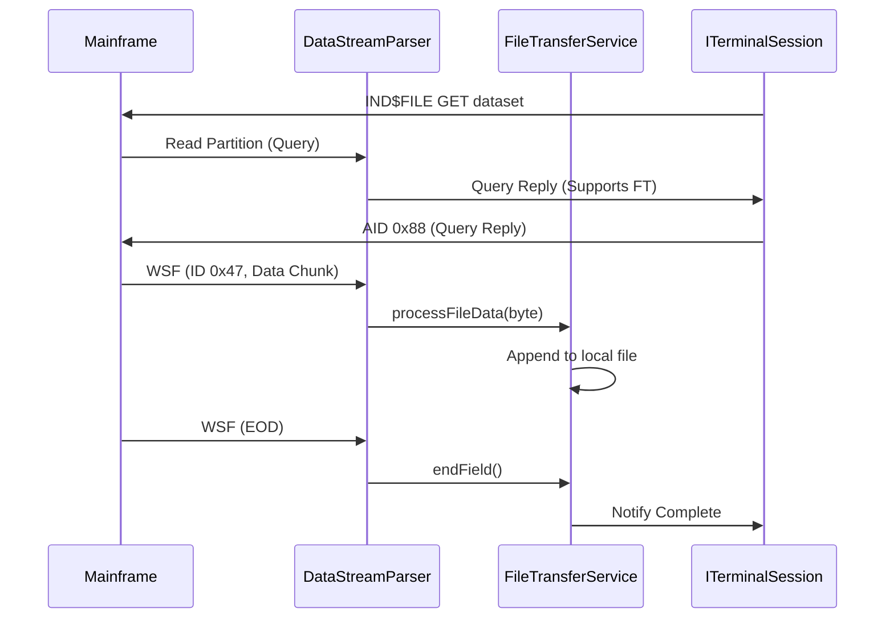

# term3270 Architecture

This document provides a high-level overview of the
term3270 terminal emulator architecture, including
system context, containers, and component-level
design.

## 1. System Context Diagram (C4 Level 1)

The System Context diagram shows how the term3270
application interacts with external systems
(Mainframe) and users.



## 2. Container Diagram (C4 Level 2)

The Container diagram illustrates the high-level
components of the application and their
responsibilities.



## 3. Core Class Diagram (UML)

The following diagram shows the relationships
between the core classes managing the terminal state
and protocol.



## 4. Data Flow (Activity Diagram)

The following diagram traces the flow of data from
the host to the screen.



> [!NOTE]
> The activity diagram above uses a simplified
> representation. Actual 3270 parsing involves state
> machines for handling multi-byte orders (SBA, SF,
> SFE, SA, RA, EUA).

## 5. Module Structure

```
term3270/
├── term3270-utilities/  # Core protocol engine
│   └── src/main/java/
│       └── com.rhlowery.term3270/
│           ├── ITerminalSession.java
│           ├── DefaultTerminalSession.java
│           ├── IDataStreamParser.java
│           ├── DataStreamParser.java
│           ├── ScreenBuffer.java
│           ├── ScreenCell.java
│           ├── FieldAttribute.java
│           ├── EbcdicConverter.java
│           ├── AddressConverter.java
│           ├── TelnetClient.java
│           ├── ConnectionConfig.java
│           ├── AIDKey.java
│           └── KeyboardMapper.java
├── term3270-app/          # Swing UI application
│   └── src/main/java/
│       └── com.rhlowery.term3270/
│           ├── Main.java
│           ├── TerminalFrame.java
│           ├── TerminalPanel.java
│           ├── ConnectionDialog.java
│           └── FunctionKeyPanel.java
└── term3270-plugins/    # Future plugin modules
```

## 6. File Transfer Sequence (IND$FILE)



## 7. Key Design Decisions

| Decision | Rationale |
|---|---|
| `ConnectionConfig` record | Immutable, thread-safe configuration object |
| `IDataStreamParser` interface | Enables 5250 protocol support |
| `EbcdicConverter` instance-based | Supports multi-codepage (Cp037, Cp285, Cp1140) |
| FlatLaf Dark L&F | Modern, professional UI appearance |
| OpenIDE Lookup | Service discovery without hard coupling |
