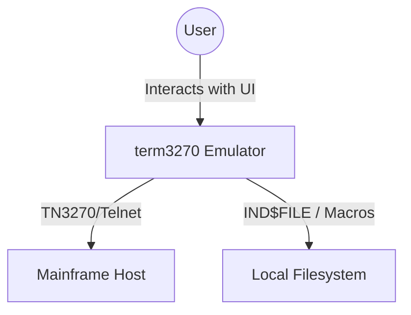
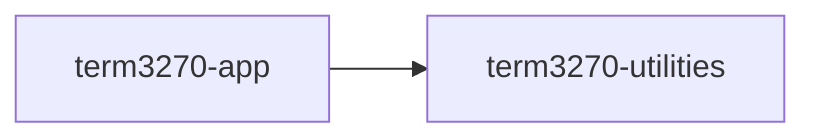
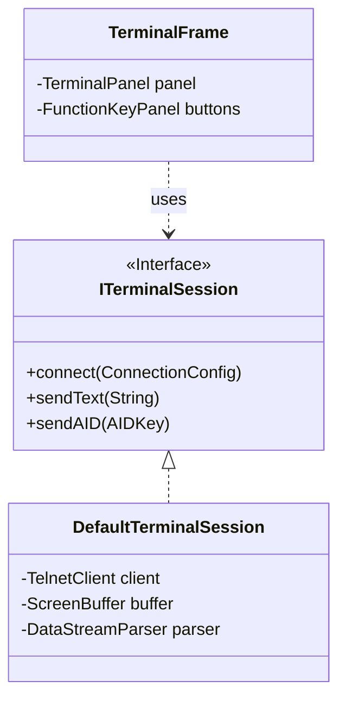
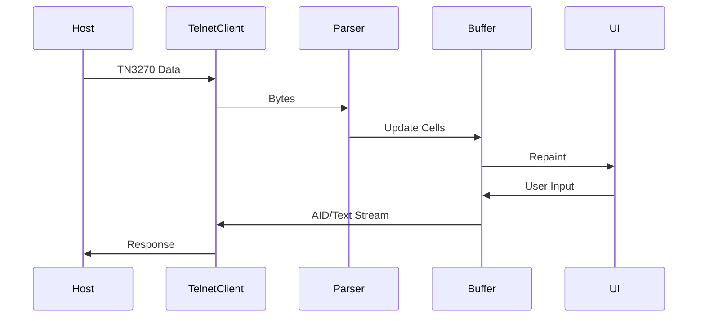

# term3270 Terminal Emulator

A modern, professional IBM 3270 terminal emulator built with Java and Swing.

## Project Structure

This project follows a multi-module Maven structure:
- **term3270-app**: Swing-based desktop application.
- **term3270-utilities**: Core protocol (TN3270) and terminal logic.
- **term3270-plugins**: Optional extension modules.

## Architecture

### C4 Context Diagram


### Module Dependencies


### High-Level Class Diagram


### Data Flow Overview


## Features
- Full TN3270 support (Model 2, 3, 4, 5).
- Extended attributes (Color, Highlight).
- Secure connections (TN3270S).
- IND$FILE transfer support.
- Macro recording and playback.
- Export screen to PDF.
- Dark theme powered by FlatLaf.

## Documentation
Comprehensive JavaDocs and architectural diagrams (PlantUML/Mermaid) are 
integrated directly into the source code via `package-info.java` files. 
Generate the full site using:
```bash
mvn site
```
The documentation will be available in `target/site/index.html`.
