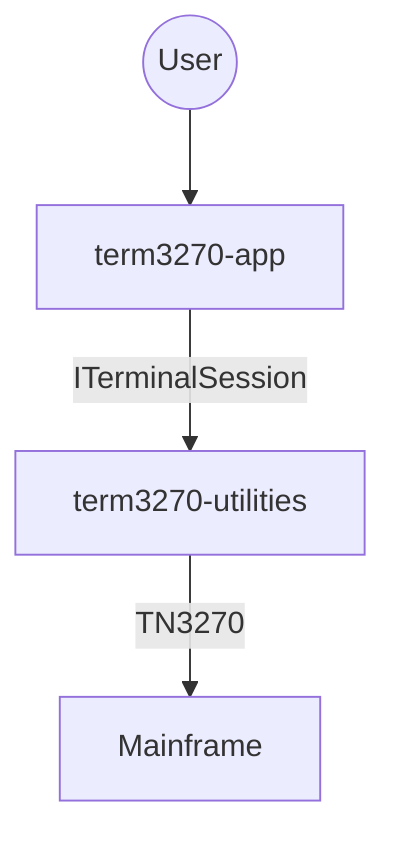
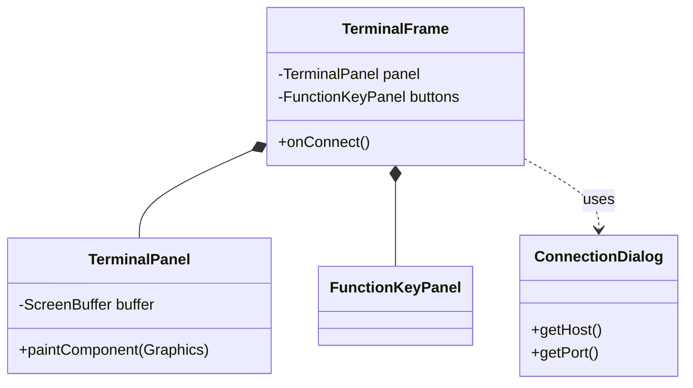
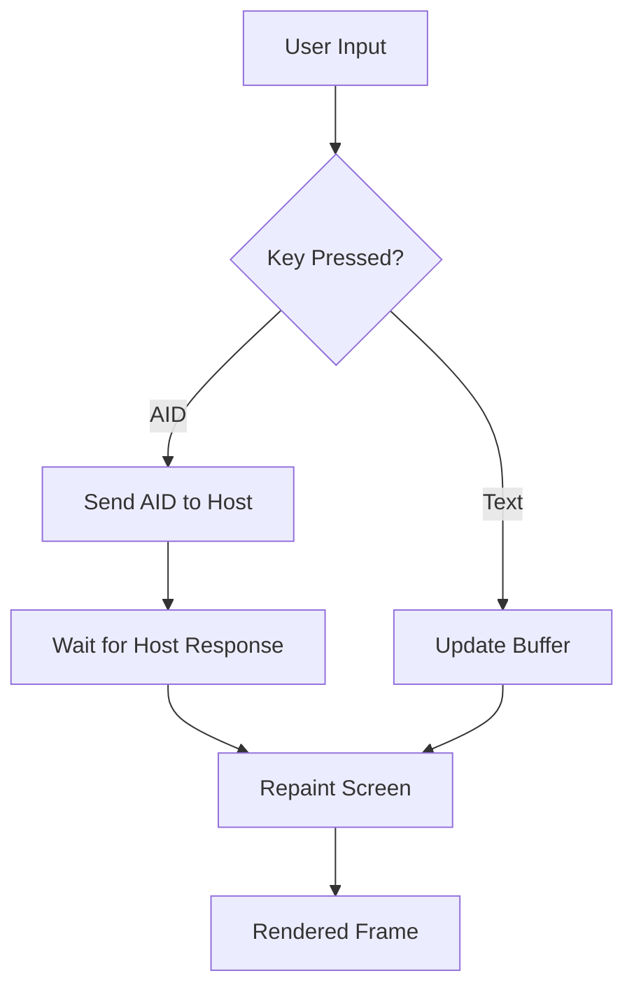

# term3270 Application Module

The Swing-based user interface for the term3270 emulator.

## Architectural Overview

### C4 Container Diagram

### Class Diagram (UI Layer)

### Activity Diagram: User Interaction Flow

## Key UI Components
- **TerminalFrame**: The main application window and menu system.
- **TerminalPanel**: Custom rendering engine for the terminal screen.
- **FunctionKeyPanel**: Modern PF key and action button interface.
- **ConnectionDialog**: UI for session configuration.
