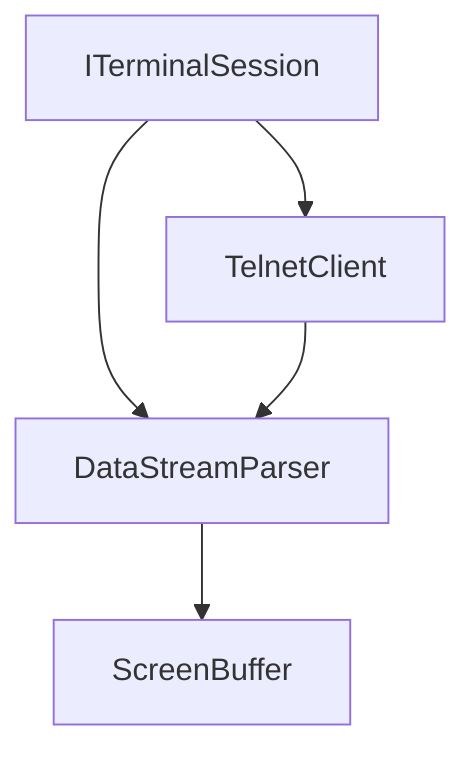
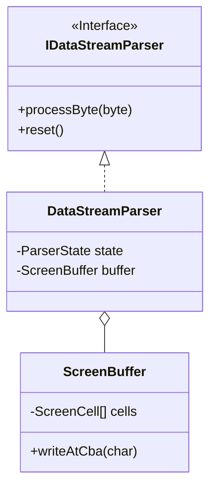
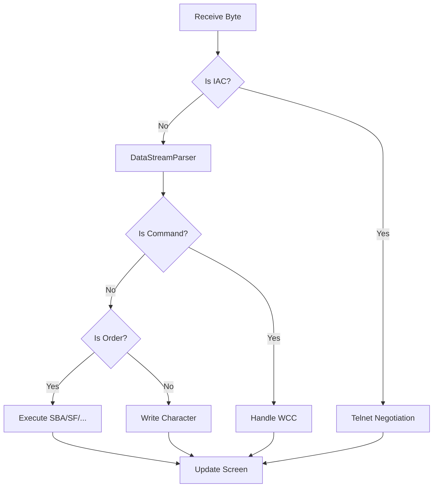

# term3270 Utilities Module

Core protocol and terminal logic for the term3270 emulator.

## Architectural Overview

### C4 Component Diagram

### Class Diagram (Protocol Layer)

### Activity Diagram: Data Stream Processing

## Key Components
- **DataStreamParser**: Implements the 3270 state machine for command and order processing.
- **ScreenBuffer**: Manages the virtual terminal grid and field attributes.
- **TelnetClient**: Handles low-level TN3270 Telnet negotiation and security.
- **EbcdicConverter**: Bidirectional translation between EBCDIC and ASCII/Unicode.
